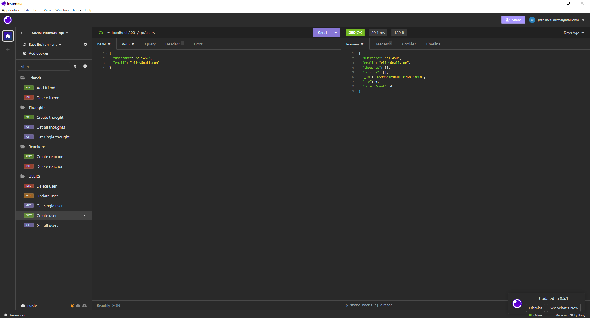

# Social Newtwork Api

## Description

My challenge wast to build an API for a social network application using Express, MongoDb, and Mongoose. 

## User Story
<pre>
AS A social media startup
I WANT an API for my social network that uses a NoSQL database
SO THAT my website can handle large amounts of unstructured data
</pre>

## Acceptance Criteria
<pre>
GIVEN a social network API
WHEN I enter the command to invoke the application
THEN my server is started and the Mongoose models are synced to the MongoDB database
WHEN I open API GET routes in Insomnia for users and thoughts
THEN the data for each of these routes is displayed in a formatted JSON
WHEN I test API POST, PUT, and DELETE routes in Insomnia
THEN I am able to successfully create, update, and delete users and thoughts in my database
WHEN I test API POST and DELETE routes in Insomnia
THEN I am able to successfully create and delete reactions to thoughts and add and remove friends to a user’s friend list
</pre>

# Screenshots and Videos

Link to entire video:
 [https://drive.google.com/file/d/1z70hehJ5qkCqn59HrVPIaj3VEFGtoTwb/view]

